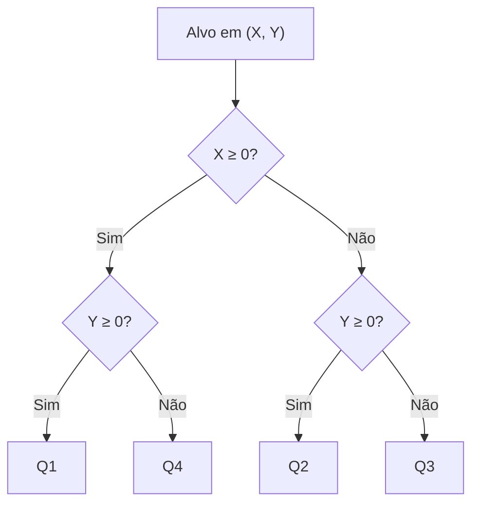
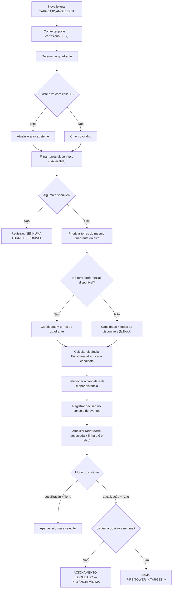

# Algoritmo de Seleção de Torre — Fundamentação Matemática

Este documento detalha, com exemplos numéricos, toda a matemática por trás do radar e da
escolha automática de torre: conversão de coordenadas, identificação de quadrantes, cálculo
de distância e o algoritmo de decisão em si.

## 1. Coordenadas polares → coordenadas cartesianas de mundo

Cada leitura de sensor chega como um par **(ângulo, distância)** — coordenadas polares
centradas na base. O ângulo é medido em graus, **sentido horário, com 0° apontando para o
Norte** (convenção de bússola/radar, mais natural para o operador do que a convenção
matemática padrão de 0°=Leste).

Convertendo para coordenadas cartesianas de mundo (X = Leste/Oeste, Y = Norte/Sul), com
`θ` em radianos:

```
x = distância · sin(θ)
y = distância · cos(θ)
```

> Nota: se `θ` fosse medido no sentido anti-horário a partir do eixo Leste (convenção
> puramente matemática, `x = d·cos θ`, `y = d·sin θ`), o resultado seria apenas uma rotação
> de 90° do mesmo radar. A convenção "0°=Norte, sentido horário" foi escolhida por ser a
> leitura mais intuitiva para quem opera um radar/bússola, mas a implementação
> (`CoordinateConverter.PolarToCartesian`) está isolada em um único método — trocar a
> convenção no futuro é uma mudança de poucas linhas em um único lugar.

### Exemplo numérico

Alvo com `ANGLE=45°`, `DIST=2.80 m`:

```
θ = 45° · (π/180) = 0.7854 rad
x = 2.80 · sin(45°) = 2.80 · 0.7071 ≈ 1.98 m
y = 2.80 · cos(45°) = 2.80 · 0.7071 ≈ 1.98 m
```

Resultado: alvo aproximadamente em `(X=1.98, Y=1.98)` — a nordeste da base.

## 2. Identificação do quadrante

Convenção fixa adotada em todo o projeto (`Helpers/QuadrantHelper.cs`):

| Quadrante | Condição |
|---|---|
| Q1 | X ≥ 0 e Y ≥ 0 |
| Q2 | X < 0 e Y ≥ 0 |
| Q3 | X < 0 e Y < 0 |
| Q4 | X ≥ 0 e Y < 0 |



No exemplo anterior, `(X=1.98, Y=1.98)` → X≥0 e Y≥0 → **Q1**.

## 3. Distância Euclidiana (alvo ↔ torre)

Para decidir qual torre está fisicamente mais próxima de um alvo, usa-se a distância
Euclidiana clássica entre dois pontos no plano:

```
d(alvo, torre) = √( (x_alvo − x_torre)² + (y_alvo − y_torre)² )
```

Implementada em `Helpers/DistanceCalculator.Euclidean`.

### Exemplo numérico

Alvo em `(1.98, 1.98)`, Torre 1 em `(3.0, 3.0)` (configuração padrão):

```
d = √( (1.98−3.0)² + (1.98−3.0)² )
  = √( (−1.02)² + (−1.02)² )
  = √( 1.0404 + 1.0404 )
  = √2.0808 ≈ 1.44 m
```

## 4. Algoritmo de seleção de torre (visão geral)



### Passo a passo (implementação: `Services/TowerSelectionService.SelectTowerFor`)

1. Filtra torres com `IsAvailable == true` e estado diferente de `Offline`/`Unavailable`.
2. Se nenhuma torre estiver disponível → decisão = "NENHUMA TORRE DISPONÍVEL", registrada e
   exibida; o alvo fica sem torre associada.
3. Entre as disponíveis, filtra as cujo `PreferredQuadrant` (calculado a partir da própria
   posição da torre) é igual ao quadrante do alvo.
4. Se existir ao menos uma torre preferencial disponível, as candidatas são só essas;
   caso contrário, **todas** as torres disponíveis viram candidatas (para nunca deixar um
   alvo sem cobertura só porque a torre "natural" do quadrante está ocupada).
5. Calcula a distância Euclidiana do alvo até cada candidata.
6. Escolhe a candidata de menor distância.
7. Atualiza `Target.SelectedTower` e `Target.DistanceToSelectedTower`, registra a decisão no
   console de eventos (`LoggingService`) e atualiza o estado visual das torres
   (`RecomputeTowerStates`).
8. Se o modo de operação for "Localização + Acionamento Automático", o
   `FireControlService` reavalia a regra de segurança antes de enviar (ou simular) o comando
   `FIRE`.

### Exemplo numérico completo

Alvo #1: `ANGLE=45°`, `DIST=2.80 m` → `(X=1.98, Y=1.98)` → **Q1**.

Torres (configuração padrão):

| Torre | Posição | Quadrante próprio | Distância até o alvo |
|---|---|---|---|
| Torre 1 | (3.0, 3.0) | Q1 | √((1.98−3)²+(1.98−3)²) ≈ **1.44 m** |
| Torre 2 | (−3.0, 3.0) | Q2 | √((1.98+3)²+(1.98−3)²) ≈ 5.16 m |
| Torre 3 | (−3.0, −3.0) | Q3 | √((1.98+3)²+(1.98+3)²) ≈ 7.04 m |
| Torre 4 | (3.0, −3.0) | Q4 | √((1.98−3)²+(1.98+3)²) ≈ 5.16 m |

Como a Torre 1 pertence ao mesmo quadrante do alvo (Q1) e está disponível, ela já seria a
única candidata do passo 4 — e, coincidentemente, também é a de menor distância entre todas.
Resultado: **Torre 1 selecionada**, distância registrada = 1.44 m.

## 5. Regra de segurança de acionamento

Antes de qualquer acionamento demonstrativo (manual ou automático), `FireControlService.Authorize` aplica:

```
autorizado = alvo.IsActive
             AND alvo.SelectedTower != null
             AND alvo.Distance ≥ distânciaMínima
```

Se `alvo.Distance < distânciaMínima`, o acionamento é bloqueado e a mensagem exata exigida
pelo enunciado é registrada:

```
ACIONAMENTO BLOQUEADO — ALVO DENTRO DA DISTÂNCIA MÍNIMA DE SEGURANÇA
```

## 6. Coordenadas de tela (apenas para desenho)

Por fim, para desenhar no `RadarControl`, as coordenadas de mundo (metros) são convertidas
em pixels (`CoordinateConverter.WorldToScreen`):

```
escala   = (tamanho_do_canvas / 2) / distância_máxima_configurada
tela_x   = (tamanho_do_canvas / 2) + x_mundo · escala
tela_y   = (tamanho_do_canvas / 2) − y_mundo · escala    // eixo Y de tela é invertido
```

O sinal invertido em `tela_y` existe porque, na tela, Y cresce para baixo, enquanto no
mundo (e na convenção de bússola) Y cresce para o Norte (para cima).
