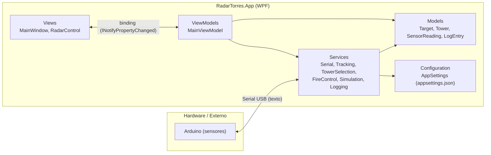
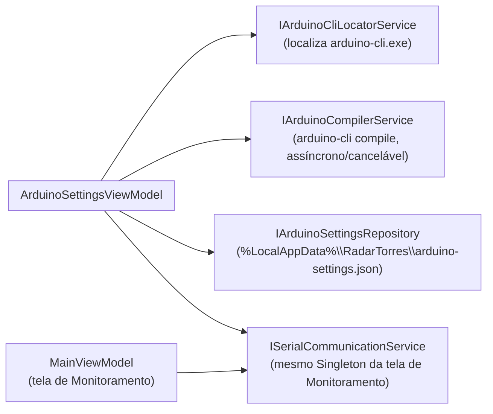
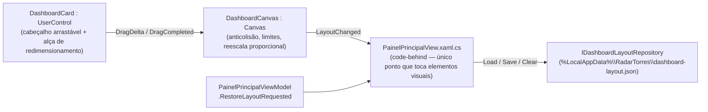
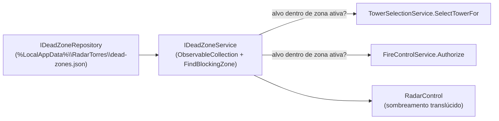

# Arquitetura do Sistema

## 1. Visão geral em camadas



* **Views** são "burras": apenas XAML + pequenos encaminhamentos de eventos de UI (ex.:
  clique em um alvo do radar chama `MainViewModel.SelectTargetById`).
* **ViewModels** (`MainViewModel`) orquestram os serviços — decidem *quando* chamar cada
  serviço em resposta a eventos, mas não implementam nenhuma regra de negócio.
* **Services** concentram toda a lógica: protocolo serial, rastreamento de alvos, seleção de
  torres, controle de acionamento e simulação. São interfaces (`I*Service`) + implementação,
  o que permite trocar qualquer um deles (ex.: por um dublê de teste) sem tocar na UI.
* **Models** são entidades de domínio simples, com `INotifyPropertyChanged` para permitir que
  a UI reaja a mudanças de estado sem que a ViewModel precise "empurrar" cada atualização
  manualmente.
* **Configuration** isola tudo que deve ser facilmente ajustável (portas, baud rate, torres,
  distâncias, timeouts) em `appsettings.json`, carregado uma única vez na inicialização.

## 2. Por que não um MVVM framework externo (Prism, CommunityToolkit.Mvvm, etc.)?

O projeto é de porte pequeno/médio e para fins didáticos (TCC). Implementar manualmente
`INotifyPropertyChanged` (`ViewModelBase`) e `ICommand` (`RelayCommand`) — cerca de 60 linhas
no total — evita uma dependência externa e deixa **todo** o mecanismo de binding visível e
explicável linha a linha na defesa do trabalho. Se o projeto crescer, a migração para
`CommunityToolkit.Mvvm` é direta, pois os nomes/padrões já seguem a mesma convenção.

## 3. Fluxo de dados de uma leitura, do sensor até a tela

```mermaid
sequenceDiagram
    participant Arduino
    participant SerialSvc as SerialCommunicationService
    participant Parser as SerialProtocolParser
    participant VM as MainViewModel
    participant Track as TargetTrackingService
    participant Tower as TowerSelectionService
    participant Fire as FireControlService
    participant Radar as RadarControl (UI)

    Arduino->>SerialSvc: "TARGET;ID=1;ANGLE=45;DIST=2.80\n"
    SerialSvc->>Parser: TryParse(linha)
    Parser-->>SerialSvc: TargetMessage(1, 45, 2.80)
    SerialSvc->>VM: evento MessageReceived
    VM->>Track: ProcessReading(SensorReading)
    Track->>Track: cria/atualiza Target (X,Y,Quadrante)
    Track-->>VM: evento TargetCreated/TargetUpdated (thread de UI)
    VM->>Tower: SelectTowerFor(target)  [se modo ≥ Localização+Torre]
    Tower-->>VM: TowerSelectionResult
    VM->>Fire: TryFireAsync(...)  [se modo = Localização+Auto e autorizado]
    Track-->>Radar: binding automático (ObservableCollection<Target>)
    Radar->>Radar: timer de renderização reposiciona os elementos gráficos
```

## 4. Concorrência — resumo das decisões

| Fonte de trabalho em segundo plano | Mecanismo | Como retorna à UI com segurança |
|---|---|---|
| Leitura contínua da porta serial | `Task.Run` dedicado (`SerialCommunicationService.ReadLoop`) com `SerialPort.ReadLine()` + `ReadTimeout` curto para permitir cancelamento cooperativo | Serviços consumidores (`LoggingService`, `TargetTrackingService`) despacham para o `Dispatcher` da UI internamente |
| Abertura/fechamento de porta | `Task.Run` dentro de métodos `async` (`ConnectAsync`) | `await`, nunca bloqueia a thread de UI que chamou |
| Watchdog de conexão | `System.Threading.Timer` (thread pool) | Só altera estado observável (`ConnectionState`); consumidores despacham |
| Geração de alvos simulados | `System.Threading.Timer` (thread pool) + `Random.Shared` (thread-safe) | Mesmo caminho de `ProcessReading` que as leituras reais |
| Timeout/expiração de alvos | `System.Threading.Timer` interno ao `TargetTrackingService` | Mutações de `ObservableCollection<Target>` despachadas via `Dispatcher.Invoke` |
| Redesenho do radar | `DispatcherTimer` (já roda na thread de UI, por design da própria classe) | N/A — já está na UI thread |
| Reset visual pós-acionamento | `Task.Delay` em `FireControlService` | Despachado via `Dispatcher.Invoke` antes de tocar `Tower.State` |

**Regra geral adotada no projeto:** qualquer classe que exponha coleções vinculadas à UI
(`ObservableCollection<T>`) ou dispare eventos que a ViewModel usa para atualizar
propriedades vinculadas é responsável por garantir, ela mesma, que a mutação ocorra na
thread de UI (captura o `Dispatcher` no construtor e usa `CheckAccess()`/`Invoke`/`BeginInvoke`).
Isso evita que o `MainViewModel` — ou qualquer código futuro — precise lembrar de fazer esse
despacho manualmente em todo lugar.

## 5.1 Aba "Configurações do Arduino" (ambiente, compilação, monitor serial)



Decisões relevantes desta funcionalidade:

* **Nenhuma segunda implementação de comunicação serial.** `ArduinoSettingsViewModel` recebe,
  por injeção de dependência, a **mesma instância Singleton** de `ISerialCommunicationService`
  já usada por `MainViewModel` (registrada uma única vez em `App.xaml.cs`). O serviço em si já
  é, portanto, o "coordenador central" da porta serial pedido para evitar dois `SerialPort`
  abertos ao mesmo tempo — a ViewModel apenas se inscreve nos eventos existentes
  (`ConnectionStateChanged`, `MessageReceived`, `CommunicationError`) e, ao conectar, verifica
  se a porta já está em uso com parâmetros diferentes antes de desconectar (com confirmação do
  usuário) e reconectar. Ver `Docs/COMUNICACAO_ARDUINO.md`, seção 8.4.
* **Compilação como processo filho assíncrono e cancelável.** `ArduinoCompilerService` chama
  `arduino-cli compile --fqbn <fqbn> <pasta-do-sketch>` via `System.Diagnostics.Process` com
  `ProcessStartInfo.ArgumentList` (nunca concatenação de string interpretada por um shell),
  captura `stdout`/`stderr` em tempo real através de `IProgress<ArduinoCliOutputLine>`, e
  respeita um `CancellationToken` (mata a árvore de processos ao cancelar). Sucesso/falha é
  decidido só pelo código de saída do processo (e pelo cancelamento explícito), nunca pela
  simples presença de texto em `stderr`.
* **Detecção do Arduino CLI sem downloads silenciosos.** `ArduinoCliLocatorService` só faz
  leitura do sistema de arquivos/`PATH` e execução do CLI já instalado (`version`,
  `board listall`) — nunca baixa nada. Ver ordem de busca em `Docs/COMUNICACAO_ARDUINO.md`,
  seção 8.1.
* **Persistência separada das preferências de usuário existentes.** As preferências desta aba
  (caminho do CLI, último sketch, FQBN, porta/baud, preferências do console) são de
  máquina/instalação, não por usuário do RadarTorres — por isso vivem em um arquivo JSON
  próprio em `%LocalAppData%\RadarTorres\arduino-settings.json`
  (`IArduinoSettingsRepository`), separado do CSV `preferencias_usuario` (tema/idioma) e do
  `appsettings.json` somente-leitura da instalação.
* **Consoles com limite de linhas.** Tanto o console de compilação quanto o do monitor serial
  descartam as linhas mais antigas acima de um limite fixo (4000), seguindo o mesmo padrão já
  usado por `LoggingService` (limite de 500 no console de eventos da tela de Monitoramento).

## 5.2 Painel principal — layout de cards arrastável/redimensionável



Decisões relevantes desta funcionalidade:

* **Posição/tamanho guardados como fração do canvas, não em pixels.** `DashboardCardLayout`
  (`RelX`/`RelY`/`RelWidth`/`RelHeight`, todos 0..1) é o que vai para o JSON. Isso resolve o
  requisito de responsividade: ao reabrir a tela em outra resolução, ou redimensionar a janela,
  cada card ocupa exatamente a mesma proporção da tela — nunca sai da área visível nem fica
  desproporcional. `DashboardCanvas` também reescala `Canvas.Left/Top/Width/Height` de todos
  os cards pela razão entre o novo e o antigo `SizeChanged`, mantendo a mesma fração enquanto o
  usuário arrasta a borda da janela em tempo real.
* **Anticolisão por rejeição, não por empurrão.** A cada `DragDelta` (arraste ou
  redimensionamento), `DashboardCanvas` calcula o retângulo proposto e testa
  `Rect.IntersectsWith` contra todos os outros cards; se colidir ou sair dos limites do canvas,
  o delta é simplesmente ignorado (o card "trava" na última posição válida) — mais simples e
  previsível do que reorganizar os demais cards a cada gesto.
* **Nenhuma lógica de posicionamento na ViewModel.** Igual ao padrão já usado em
  `ArduinoSettingsView` para diálogos de arquivo (seção 5.1): posição/tamanho de elementos
  visuais é estado de UI, não de domínio. `PainelPrincipalViewModel` só expõe
  `RestoreDefaultLayoutCommand` e o evento `RestoreLayoutRequested`; quem efetivamente lê/grava
  o `DashboardCanvas` é o code-behind de `PainelPrincipalView`.
* **Persistência no mesmo padrão de `ArduinoSettingsRepository`.** `DashboardLayoutRepository`
  grava um único JSON (`Dictionary<string, DashboardCardLayout>`, chave = `DashboardCard.CardId`)
  em `%LocalAppData%\RadarTorres\dashboard-layout.json`, a cada `DragCompleted` (não a cada
  pixel de `DragDelta`, para não gerar I/O excessivo). "Restaurar layout padrão" rearranja os
  cards em uma grade fixa (3 colunas) e regrava o arquivo.

## 5.3 Zonas mortas (quadrante ou faixa de distância sem torre/acionamento)



Decisões relevantes desta funcionalidade:

* **Alvo continua visível/rastreado — só não recebe torre nem pode ser acionado.** Uma zona
  morta não filtra o `TargetTrackingService`; `TowerSelectionService.SelectTowerFor` e
  `FireControlService.Authorize` consultam `IDeadZoneService.FindBlockingZone` antes de
  qualquer outra regra e recusam a operação (com o alvo continuando visível/selecionável no
  radar), em vez de esconder o alvo. O bloqueio é checado nos dois pontos independentemente,
  para que o acionamento manual também respeite a zona mesmo que uma torre já tivesse sido
  selecionada antes de a zona existir/ser ativada.
* **Duas formas de zona, um único modelo.** `DeadZone.Type` decide se `Quadrant` (todo um
  quadrante Q1-Q4) ou `MinDistance`/`MaxDistance` (faixa de distância da base, qualquer
  direção) é relevante — a UI mostra só os campos pertinentes ao tipo escolhido
  (`EnumEqualsToVisibilityConverter`).
* **Persistência única para a instalação, não por usuário.** Mesmo padrão JSON de
  `ArduinoSettingsRepository`, mas sem chave de usuário: zonas mortas são uma decisão
  administrativa de segurança, não uma preferência pessoal — todo operador vê a mesma lista.
* **Só o Administrador cria/ativa/desativa/remove.** `IPermissionService.PodeGerenciarZonasMortas`
  segue o mesmo princípio dos demais controles de perfil do projeto (checagem centralizada, não
  espalhada pela UI); os demais perfis continuam vendo a lista somente-leitura, para saber onde
  o sistema deliberadamente não vai agir.
* **Sem edição de campos após criada.** Só `Enabled` é mutável numa zona existente — trocar
  tipo/quadrante/faixa é remover e recriar, o que mantém o formulário e a validação simples
  (evita, por exemplo, ter que revalidar uma faixa em edição parcial).
* **Visualização no radar reaproveita a mesma conversão metros→pixel do resto do desenho.**
  `RadarControl` recebe `DeadZones` como mais uma propriedade de dependência (mesmo padrão de
  `Targets`/`Towers`) e desenha cada zona ativa na camada estática: um quarto de círculo inteiro
  (`PathGeometry` com `ArcSegment`) para zona por quadrante, ou um anel (`CombinedGeometry` de
  duas `EllipseGeometry`, modo `Exclude`) para zona por faixa de distância — ambos com o mesmo
  `CoordinateConverter` já usado para posicionar alvos/torres.

## 5. Extensibilidade

* **Trocar o protocolo serial:** só `SerialProtocolParser` precisa mudar; todo o resto do
  sistema consome os tipos `SerialMessage` já decodificados.
* **Adicionar/remover torres:** apenas editar `appsettings.json` (`Towers`), sem recompilar.
* **Novo tipo de sensor/fonte de dados:** basta produzir objetos `SensorReading` e chamar
  `ITargetTrackingService.ProcessReading` — é exatamente assim que tanto a serial real quanto
  o simulador alimentam o mesmo pipeline.
* **Novo algoritmo de seleção de torre:** `ITowerSelectionService` pode ganhar uma implementação
  alternativa (ex.: considerando ângulo de cobertura, carga de trabalho por torre, etc.) sem
  tocar em nenhuma outra camada.
