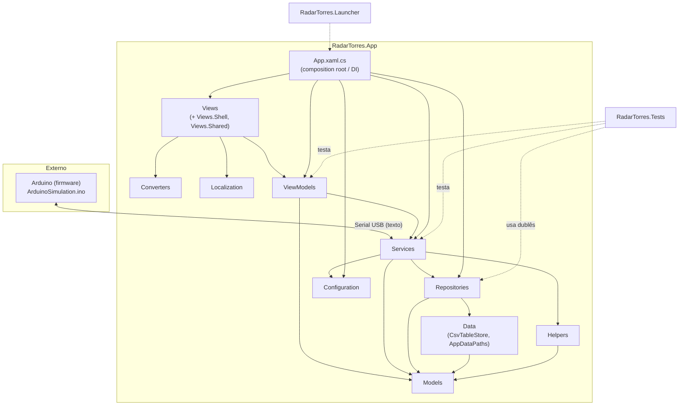

# Diagrama de Pacotes

> Organização por pastas/namespaces reais do repositório (nenhum pacote foi inventado — cada um
> corresponde a uma pasta existente em `src/RadarTorres.App/` ou a um projeto/pasta de nível
> superior do repositório).

## 1. Pacotes e responsabilidades

| Pacote | Caminho | Responsabilidade | Elementos principais |
|---|---|---|---|
| `RadarTorres.App.Models` | `src/RadarTorres.App/Models/` | Entidades de domínio e enums compartilhados | `Target`, `Tower`, `SensorReading`, `Usuario`, `ObjetoDetectado`, `AcaoRealizada`, `AlteracaoModo`, `DeadZone`, `PreferenciasUsuario`, `ChamadoAjuda`, `SystemState`, `DashboardCardLayout` |
| `RadarTorres.App.Configuration` | `src/RadarTorres.App/Configuration/` | Modelo tipado de `appsettings.json` e preferências de ferramenta externa | `AppSettings`, `AppConfig`, `ArduinoCliSettings` |
| `RadarTorres.App.Helpers` | `src/RadarTorres.App/Helpers/` | Funções puras de apoio (matemática, comando MVVM) | `CoordinateConverter`, `DistanceCalculator`, `QuadrantHelper`, `RelayCommand` |
| `RadarTorres.App.Services` | `src/RadarTorres.App/Services/` | Toda a regra de negócio (protocolo serial, rastreamento, seleção de torre, acionamento, simulação, autenticação, permissões, exportação, i18n, tema) | `SerialCommunicationService`, `TargetTrackingService`, `TowerSelectionService`, `FireControlService`, `SimulationService`, `AuthService`, `PermissionService`, `ObjetoDetectadoExportService`, entre outros |
| `RadarTorres.App.Repositories` | `src/RadarTorres.App/Repositories/` | Persistência CSV, uma interface + implementação por entidade auditável/cadastral | `IUsuarioRepository`/`CsvUsuarioRepository`, `IObjetoDetectadoRepository`/`CsvObjetoDetectadoRepository`, etc. |
| `RadarTorres.App.Data` | `src/RadarTorres.App/Data/` | Motor genérico de CSV e caminhos de dados do usuário | `CsvTableStore<T>`, `CsvColumn<T>`, `CsvConvert`, `AppDataPaths`, `DataSeeder` |
| `RadarTorres.App.ViewModels` | `src/RadarTorres.App/ViewModels/` | Orquestração MVVM — ponte entre Views e Services, sem regra de negócio própria | `ViewModelBase`, `MainViewModel`, `ArduinoSettingsViewModel`, `ObjetosDetectadosViewModel`, `LoginViewModel`, `ShellViewModel` |
| `RadarTorres.App.Views` | `src/RadarTorres.App/Views/` (+ `Views/Shell/`, `Views/Shared/`) | XAML + code-behind mínimo (diálogos de arquivo, encaminhamento de eventos de UI) | `MonitoramentoView`, `PainelPrincipalView`, `ObjetosDetectadosView`, `ArduinoSettingsView`, `ShellWindow`, `RadarControl`, `DashboardCanvas`, `DashboardCard` |
| `RadarTorres.App.Converters` | `src/RadarTorres.App/Converters/` | `IValueConverter` de exibição, sem lógica de negócio | `ConnectionStateToBrushConverter`, `QuadrantToLabelConverter`, etc. |
| `RadarTorres.App.Localization` | `src/RadarTorres.App/Localization/` | Extensão de marcação XAML para textos localizados | `LocExtension` |
| `RadarTorres.App` (raiz) | `src/RadarTorres.App/App.xaml(.cs)` | Composition root: registra serviços/DI, trata exceções globais | `App` |
| `RadarTorres.Launcher` | `src/RadarTorres.Launcher/` | Executável leve que inicia o app principal (usado pelo instalador) | `Program` |
| `RadarTorres.Tests` | `tests/RadarTorres.Tests/` | Testes automatizados (xUnit) — hoje cobre a aba Configurações do Arduino | `ArduinoCliLocatorServiceTests`, `ArduinoCompilerServiceTests`, `ArduinoSettingsRepositoryTests`, `ArduinoSettingsViewModelTests`, `Fakes/` |
| `Arduino` (firmware) | `Arduino/` | Sketch de teste do protocolo serial, sem sensores reais | `ArduinoSimulation.ino` |
| `Docs` / `docs` | `Docs/`, `docs/` | Documentação de arquitetura, protocolo, dados, e (esta pasta) diagramas/requisitos de engenharia | arquivos `.md` |
| `installer` | `installer/` | Script do instalador Windows | `RadarTorres.iss` (Inno Setup) |
| `build` | `build/` | Automação de publicação | `publish.ps1` |

## 2. Dependências entre pacotes

Regra observada no código (e documentada em `Docs/ARQUITETURA.md`): a dependência flui em uma
única direção — `Views → ViewModels → Services → (Models | Repositories | Configuration)` —,
nunca no sentido inverso, e nenhuma classe de `Services`/`Repositories`/`Models` referencia
tipos de WPF.

## 3. Justificativa das dependências

* **Views não são referenciadas por nenhum outro pacote** (seta só sai delas) — garante que a
  lógica nunca dependa de WPF, permitindo testar `Services`/`ViewModels` sem UI.
* **Services nunca dependem de ViewModels ou Views** — a "fronteira MVVM" citada em
  `Docs/ARQUITETURA.md`.
* **Repositories dependem só de Data e Models** — trocar CSV por SQL (`TODO(SQL)`, ver
  `Docs/MODELO_DADOS.md`) não exigiria alterar `Services`/`ViewModels`/`Views`, só o pacote
  `Data`/`Repositories`.
* **`RadarTorres.Tests`** depende de `Services`/`ViewModels`/`Repositories` só para testá-los
  (referência de projeto de teste, não de produção) — por isso a seta é tracejada.
* **Arduino** comunica-se com `Services` (mais especificamente `SerialCommunicationService`)
  exclusivamente por porta serial/texto — não há dependência de compilação entre os dois lados.
