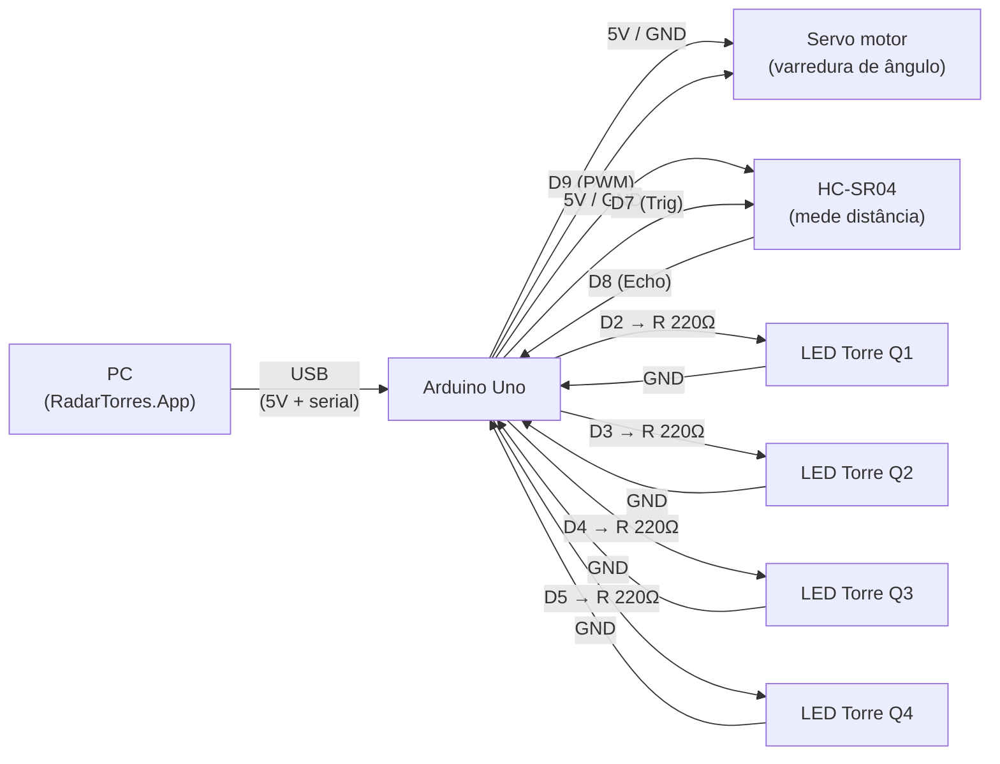

# Diagrama Elétrico (conceitual/funcional)

> Hardware ainda não estava especificado no projeto (até aqui só existe o firmware de simulação,
> `Arduino/ArduinoSimulation.ino`, sem sensores/atuadores reais). Os componentes abaixo foram
> confirmados com o autor em 2026-09-19. Este diagrama mostra **quais sinais ligam a quais pinos**
> — não é um esquemático elétrico completo (footprints/trilhas); para a montagem física, use uma
> ferramenta dedicada (Fritzing/KiCad).

## 1. Componentes

| Componente | Papel | Observação |
|---|---|---|
| Arduino Uno | Microcontrolador (ATmega328P, lógica 5V) | Alimentado via USB pelo PC — mesma porta usada para o protocolo serial (`Docs/Tecnica/COMUNICACAO_ARDUINO.md`) |
| Servo motor (ex.: SG90) | Varre o ângulo de detecção | Sinal PWM |
| Sensor ultrassônico HC-SR04 | Mede a distância na posição angular atual | Lógica 5V — compatível direto com o Uno, sem divisor de tensão |
| 4x LED + 4x resistor 220Ω | Indicador de torre selecionada (1 por quadrante Q1–Q4) | Ver `enum Quadrant` em `src/RadarTorres.App/Models/SystemState.cs` |

## 2. Pinagem

| Sinal | Pino Arduino Uno | Conecta em |
|---|---|---|
| Servo — VCC | 5V | Servo VCC (vermelho) |
| Servo — GND | GND | Servo GND (marrom) |
| Servo — Sinal | D9 (PWM) | Servo sinal (laranja) |
| HC-SR04 — VCC | 5V | HC-SR04 VCC |
| HC-SR04 — GND | GND | HC-SR04 GND |
| HC-SR04 — Trig | D7 | HC-SR04 Trig |
| HC-SR04 — Echo | D8 | HC-SR04 Echo |
| LED Torre Q1 | D2 → resistor 220Ω → LED → GND | |
| LED Torre Q2 | D3 → resistor 220Ω → LED → GND | |
| LED Torre Q3 | D4 → resistor 220Ω → LED → GND | |
| LED Torre Q4 | D5 → resistor 220Ω → LED → GND | |

## 3. Diagrama

Fonte PlantUML equivalente: `Diagrama_Eletrico_RadarTorres.puml` (mesma pasta).

## 4. Observações

- **Alimentação do servo**: se houver tremulação ou reset do Arduino ao mover o servo, alimentá-lo
  por fonte externa 5V (GND comum ao Arduino) — o pino 5V do Uno tem corrente limitada (~500 mA
  via USB), e um servo em movimento pode picar corrente acima disso.
- **Echo do HC-SR04 em 5V**: compatível direto com a lógica 5V do Arduino Uno. Um divisor de tensão
  só seria necessário com um microcontrolador de lógica 3.3V (ex.: ESP32).
- **Quantidade de LEDs**: 4 (um por quadrante Q1–Q4). Ajustar se o número real de torres físicas
  for diferente do modelo de domínio atual.
- **Pinos sugeridos** (D7–D9, D2–D5): não há reserva de pinos no firmware atual
  (`ArduinoSimulation.ino` não lê sensores reais), então a numeração é uma proposta — ajustar
  conforme o firmware definitivo for implementado.
