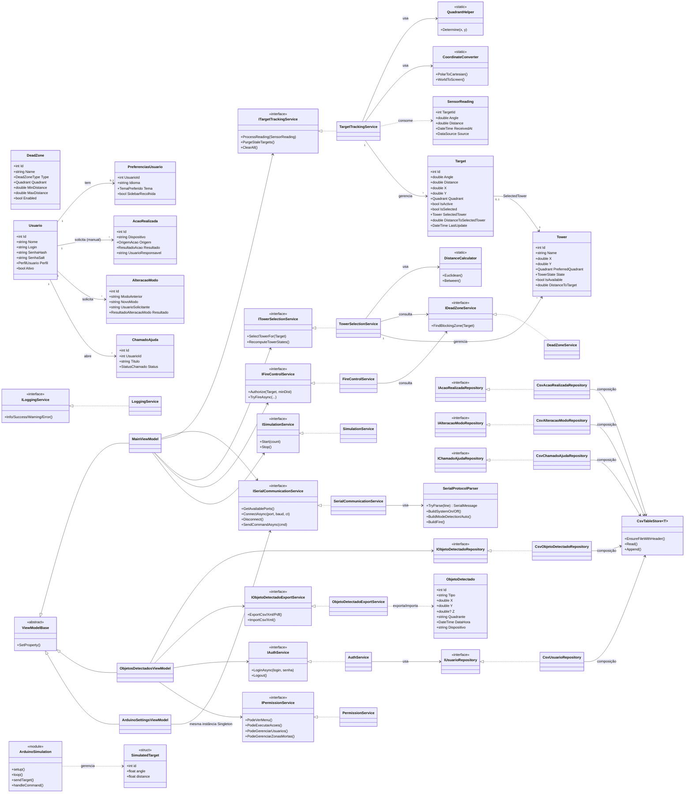

# Diagrama de Classes

> Base desta análise: código-fonte em `src/RadarTorres.App/` (Models, Services, Repositories,
> ViewModels), `Arduino/ArduinoSimulation.ino` e a documentação já existente em `Docs/` do
> repositório (`ARQUITETURA.md`, `DOCUMENTACAO_TECNICA.md`, `MODELO_DADOS.md`,
> `COMUNICACAO_ARDUINO.md`). Nenhum dado foi inventado; onde a fonte é uma inferência (não uma
> leitura direta de código), isso está marcado explicitamente.

## 1. Observação sobre o Arduino

O firmware (`Arduino/ArduinoSimulation.ino`) é escrito em C/C++ estilo Arduino **sem
orientação a objetos formal** — não há `class`, apenas uma `struct SimulatedTarget` (dados
puros) e funções globais (`setup`, `loop`, e as funções de leitura/envio de protocolo). Por
isso, no diagrama de classes ele é representado por:

* uma **estrutura de dados** (`SimulatedTarget`), equivalente a uma classe sem métodos;
* um **módulo de funções globais** (`ArduinoSimulation`), representado como uma classe
  estereotipada `<<module>>`, reunindo as funções do sketch como se fossem métodos estáticos —
  adaptação necessária porque o C/C++ para Arduino não tem classes nesse sketch, mas o
  conjunto de funções tem responsabilidade coesa (gerar alvos simulados e falar o protocolo
  serial).

Do lado do aplicativo C#, todas as classes seguem POO plena (interfaces `I*Service`/`I*Repository`
+ implementação, herança de `INotifyPropertyChanged`, etc.), então são representadas de forma
convencional.

## 2. Principais elementos e responsabilidades

### Models (entidades de domínio)

| Classe | Responsabilidade | Atributos principais | Observações |
|---|---|---|---|
| `Target` | Alvo detectado, vivo em memória, atualizado a cada leitura pelo mesmo `Id` | `Id`, `Angle`, `Distance`, `X`, `Y`, `Quadrant`, `IsActive`, `IsSelected`, `SelectedTower`, `DistanceToSelectedTower`, `LastUpdate` | Implementa `INotifyPropertyChanged` |
| `Tower` | Torre demonstrativa carregada de `appsettings.json` | `Id`, `Name`, `X`, `Y`, `PreferredQuadrant`, `State`, `IsAvailable`, `DistanceToTarget` | Implementa `INotifyPropertyChanged` |
| `SensorReading` | DTO imutável de uma leitura já validada (serial real ou simulada) | `TargetId`, `Angle`, `Distance`, `ReceivedAt`, `Source` | Consumido por `TargetTrackingService.ProcessReading` |
| `DeadZone` | Zona onde alvos não recebem torre/acionamento | `Id`, `Name`, `Type`, `Quadrant`, `MinDistance`, `MaxDistance`, `Enabled` | Implementa `INotifyPropertyChanged` |
| `Usuario` | Conta de acesso ao aplicativo | `Id`, `Nome`, `Login`, `SenhaHash`, `SenhaSalt`, `Perfil`, `Ativo`, `DataCriacao`, `UltimoAcesso` | — |
| `ObjetoDetectado` | Registro histórico (CSV) de uma primeira detecção | `Id`, `Tipo`, `X`, `Y`, `Z?`, `Quadrante`, `DataHora`, `Dispositivo`, `NivelConfianca?`, `Observacao?`, `ReferenciaImagem?` | Gerado a partir do evento `TargetCreated` |
| `AcaoRealizada` | Auditoria de acionamento (só inserção) | `Id`, `Dispositivo`, `TipoAcao`, `X`, `Y`, `Z?`, `DataHora`, `UsuarioResponsavel?`, `Origem`, `Resultado`, `Observacao?` | Gravado por `FireControlService` |
| `AlteracaoModo` | Auditoria de troca de `SystemMode` (só inserção) | `Id`, `ModoAnterior`, `NovoModo`, `DataHoraSolicitacao`, `UsuarioSolicitante`, `DataHoraExecucao?`, `Resultado`, `Observacao?` | — |
| `PreferenciasUsuario` | Preferências de UI por usuário | `UsuarioId` (PK=FK), `Idioma`, `Tema`, `SidebarRecolhida`, `TelaInicial?`, `RegistrosPorPagina` | 1:1 com `Usuario` |
| `ChamadoAjuda` | Chamado de suporte aberto pelo usuário | `Id`, `UsuarioId`, `UsuarioNome`, `Titulo`, `Descricao`, `Categoria`, `ModuloRelacionado?`, `MensagemErro?`, `DataHoraEnvio`, `Status`, `RespostaAdmin?`, `DataResolucao?` | — |
| `DashboardCardLayout` | Layout persistido de um card do painel | `RelX/RelY/RelWidth/RelHeight` (0..1), `IsVisible`, `ZIndex`, `IsPinnedRight` | Chave = `DashboardCard.CardId` (fora da classe) |
| `LogEntry` | Linha imutável do console de eventos | `Timestamp`, `Level`, `Message` | — |
| `ArduinoCliInfo` | Resultado da detecção do `arduino-cli.exe` | `Found`, `ExecutablePath?`, `Version?`, `Source` | — |
| `ArduinoCompileResult` | Resultado de uma compilação | `Status`, `ExitCode?`, `Duration` | — |
| `ArduinoCliOutputLine` | Linha do console de compilação/monitor | `Timestamp`, `Stream`, `Text` | — |
| `ArduinoBoardOption` | Placa/FQBN selecionável (record) | `Fqbn`, `DisplayName` | `ArduinoBoardCatalog.DefaultBoards` é a lista curada estática |

### Services (regras de negócio — interfaces `I*` + implementação)

| Classe | Responsabilidade | Métodos/eventos principais | Depende de |
|---|---|---|---|
| `SerialProtocolParser` | Interpreta/monta o protocolo textual PC↔Arduino | `TryParse`, `BuildSystemOn/Off`, `BuildModeDetection/Auto`, `BuildSetMinDistance/MaxDistance`, `BuildFire` | — |
| `SerialCommunicationService` (`ISerialCommunicationService`) | Transporte serial: listar portas, conectar, ler em loop, enviar, watchdog | `GetAvailablePorts`, `ConnectAsync`, `Disconnect`, `SendCommandAsync`; eventos `MessageReceived`, `ConnectionStateChanged`, `CommunicationError` | `SerialProtocolParser`, `AppConfig` |
| `TargetTrackingService` (`ITargetTrackingService`) | Cria/atualiza/expira `Target` a partir de `SensorReading` | `ProcessReading`, `PurgeStaleTargets`, `ClearAll`; eventos `TargetCreated`, `TargetUpdated`, `TargetRemoved` | `QuadrantHelper`, `CoordinateConverter` |
| `TowerSelectionService` (`ITowerSelectionService`) | Algoritmo de seleção de torre | `SelectTowerFor`, `RecomputeTowerStates` | `DistanceCalculator`, `IDeadZoneService` |
| `FireControlService` (`IFireControlService`) | Regra de segurança + acionamento demonstrativo | `Authorize`, `TryFireAsync` | `IDeadZoneService` |
| `SimulationService` (`ISimulationService`) | Gera alvos fictícios | `Start`, `Stop`, `AddRandomTarget`, `RemoveTarget`; evento `ReadingGenerated` | `AppConfig` |
| `LoggingService` (`ILoggingService`) | Console de eventos thread-safe | `Info`, `Success`, `Warning`, `Error`, `Clear` | — |
| `AuthService` (`IAuthService`) | Login/logout/sessão | `LoginAsync`, `Logout`, `AlterarSenhaAsync`; evento `SessionChanged` | `IUsuarioRepository`, `IPasswordHasher` |
| `PasswordHasher` (`IPasswordHasher`) | Hash PBKDF2-HMACSHA256 de senha | (hash/verify) | — |
| `PermissionService` (`IPermissionService`) | Regras de acesso por perfil | `PodeVerMenu`, `PodeExecutarAcoes`, `PodeGerenciarUsuarios`, `PodeGerenciarZonasMortas` | — |
| `DeadZoneService` (`IDeadZoneService`) | Avalia se um alvo está bloqueado | `FindBlockingZone` (inferido do uso em `ARQUITETURA.md`) | `IDeadZoneRepository` |
| `ArduinoCliLocatorService` (`IArduinoCliLocatorService`) | Localiza `arduino-cli.exe` | `Locate`, `GetVersionAsync`, `ListInstalledBoardsAsync` | — |
| `ArduinoCompilerService` (`IArduinoCompilerService`) | Compila sketch como processo filho | `CompileAsync` | `System.Diagnostics.Process` |
| `ArduinoSettingsRepository` (`IArduinoSettingsRepository`) | Persiste `ArduinoCliSettings` em JSON | `Load`, `Save` | — |
| `DashboardLayoutRepository` (`IDashboardLayoutRepository`) | Persiste layout dos cards em JSON | `Load`, `Save`, `Clear` | — |
| `ObjetoDetectadoExportService` (`IObjetoDetectadoExportService`) | Exporta/importa `ObjetoDetectado` | `ExportCsv/Xml/Pdf`, `ImportCsv/Xml` | `CsvTableStore`, `XmlSerializer`, PdfSharp |
| `LocalizationService` (`ILocalizationService`) | i18n pt-BR/en-US | (troca de cultura em runtime — inferido do uso) | — |
| `ThemeService` (`IThemeService`) | Tema claro/escuro/sistema | (aplica tema — inferido do uso) | — |
| `NavigationService` (`INavigationService`) | Navegação entre telas da Shell | (troca de view atual — inferido do uso) | — |

### Repositories (persistência CSV)

| Classe | Responsabilidade |
|---|---|
| `CsvUsuarioRepository` (`IUsuarioRepository`) | CRUD de `Usuario` em `usuarios.csv` |
| `CsvObjetoDetectadoRepository` (`IObjetoDetectadoRepository`) | Insere/lista `ObjetoDetectado` em `objetos_detectados.csv`; expõe `BuildColumns()` estático reaproveitado pela exportação |
| `CsvAcaoRealizadaRepository` (`IAcaoRealizadaRepository`) | Só-inserção de `AcaoRealizada` |
| `CsvAlteracaoModoRepository` (`IAlteracaoModoRepository`) | Só-inserção de `AlteracaoModo` |
| `CsvPreferenciasUsuarioRepository` (`IPreferenciasUsuarioRepository`) | CRUD 1:1 de `PreferenciasUsuario` |
| `CsvChamadoAjudaRepository` (`IChamadoAjudaRepository`) | CRUD (com Update) de `ChamadoAjuda` |
| `CsvTableStore<T>` | Motor genérico de leitura/escrita CSV usado por todos os repositórios acima (`EnsureFileWithHeader`, etc.) |

Todos os repositórios CSV dependem de `CsvTableStore<T>` (composição) e de `AppDataPaths`
(caminho em `%AppData%\RadarTorres\Data\`).

### ViewModels

| Classe | Responsabilidade | Depende de (composição/DI) |
|---|---|---|
| `ViewModelBase` | Implementa `INotifyPropertyChanged` (`SetProperty`) — base de todas as ViewModels | — |
| `MainViewModel` | Orquestra a tela de Monitoramento (radar, serial, torres, acionamento) | `ISerialCommunicationService`, `ITargetTrackingService`, `ITowerSelectionService`, `IFireControlService`, `ISimulationService`, `ILoggingService` |
| `ArduinoSettingsViewModel` | Orquestra a aba Configurações do Arduino | `IArduinoCliLocatorService`, `IArduinoCompilerService`, `IArduinoSettingsRepository`, `ISerialCommunicationService` (mesma instância de `MainViewModel`) |
| `ObjetosDetectadosViewModel` | Lista + exporta/importa `ObjetoDetectado` | `IObjetoDetectadoRepository`, `IObjetoDetectadoExportService`, `ILoggingService`, `IAuthService`, `IPermissionService` |
| `PainelPrincipalViewModel` | Comando de restaurar layout padrão do painel | (evento consumido pela View) |
| `LoginViewModel` | Autenticação | `IAuthService` |
| `ProfileViewModel` | Perfil do usuário logado, troca de senha | `IAuthService` |
| `HelpDeskFormViewModel` | Envio de `ChamadoAjuda` | `IChamadoAjudaRepository`, `IAuthService` |
| `ShellViewModel` | Estado da casca (barra lateral, navegação) | `INavigationService`, `IPermissionService` |
| `SidebarMenuEntry` | Item de menu da barra lateral (dado, não orquestrador) | — |

### Helpers (funções puras, sem estado)

| Classe | Responsabilidade |
|---|---|
| `CoordinateConverter` | Polar↔cartesiano↔tela |
| `DistanceCalculator` | Distância euclidiana |
| `QuadrantHelper` | Determina quadrante Q1-Q4 |
| `RelayCommand` | Implementação de `ICommand` (MVVM manual) |

### Arduino (`Arduino/ArduinoSimulation.ino`)

| Elemento | Tipo | Equivalente OO | Responsabilidade |
|---|---|---|---|
| `SimulatedTarget` | `struct` | Classe de dados (sem métodos) | Guarda `id`, `angle`, `distance` de um alvo fictício |
| `ArduinoSimulation` (módulo) | Conjunto de funções globais (`setup`, `loop`, geração/envio de `TARGET`, leitura/interpretação de comandos `SYSTEM`/`MODE`/`SET`/`FIRE`) | Classe `<<module>>` (estereótipo, funções estáticas) | Gera alvos simulados e fala o protocolo serial descrito em `COMUNICACAO_ARDUINO.md` |

## 3. Diagrama de Classes (Mermaid)

## 4. Validação

* Todas as classes/atributos/métodos acima foram lidos diretamente dos arquivos-fonte em
  `src/RadarTorres.App/` — nenhum nome foi inventado.
* Métodos de `ILocalizationService`, `IThemeService`, `INavigationService` e `IDeadZoneService`
  não tiveram a assinatura completa lida (fora do escopo desta varredura); a responsabilidade
  listada é **inferida** do uso descrito em `Docs/Tecnica/ARQUITETURA.md` e do nome da interface —
  marcado na tabela de Services acima.
* `ArduinoSimulation.ino` não usa classes — a representação como `<<module>>`/`<<struct>>` é uma
  adaptação explícita, descrita na seção 1.
