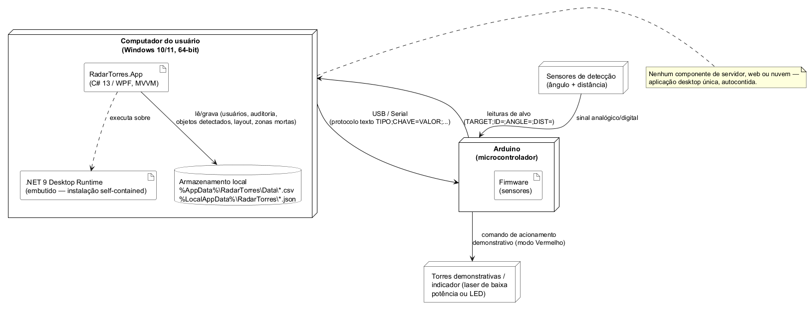

# Diagrama de Implantação

> Base desta análise: `installer/RadarTorres.iss` (instalador), `src/RadarTorres.App/App.xaml.cs`
> (composition root), `Arduino/ArduinoSimulation.ino` e `Docs/Tecnica/COMUNICACAO_ARDUINO.md`
> (protocolo serial). Nenhum nó, artefato ou protocolo foi inventado.

## 1. Nós e elementos

| Nó | Elemento | Papel |
|---|---|---|
| Computador do Usuário (Windows 10/11, 64-bit) | `RadarTorres.App` (.exe) | Único processo, self-contained, instalado por `installer/RadarTorres.iss` |
| ↳ dentro do processo | Apresentação (`Views` + `ViewModels`) | Captura interação do operador, binding declarativo (`ViewModelBase`, `RelayCommand`) |
| ↳ dentro do processo | Serviços (regra de negócio) | `ISerialCommunicationService`, `ITargetTrackingService`, `ITowerSelectionService`, `IFireControlService`, `IDeadZoneService`, `IAuthService`, `IPermissionService` |
| ↳ dentro do processo | Persistência local | Leitura/escrita dos arquivos CSV/JSON de dados e preferências |
| ↳ dentro do processo | .NET 9 Desktop Runtime | Embutido pelo instalador — sem dependência externa a instalar |
| Arduino (microcontrolador) | Firmware | Lê sensores, envia leituras de alvo, recebe comandos, aciona torres demonstrativas |
| Armazenamento local (disco do usuário) | `%AppData%\RadarTorres\Data\*.csv` / `%LocalAppData%\RadarTorres\*.json` | Usuários, auditoria, objetos detectados, layout, zonas mortas, preferências |
| Sensores de detecção | — | Ângulo + distância, alimentam o Arduino |
| Torres demonstrativas / indicador | — | Laser de baixa potência ou LED, nunca armamento real |

## 2. Diagrama de Implantação

Diagrama fonte: [`Implantacao_RadarTorres.puml`](Implantacao_RadarTorres.puml).

## 3. Explicação

O diagrama representa apenas **dois nós físicos reais**: o computador do usuário e o Arduino,
conectados exclusivamente por **USB/serial** (protocolo texto `TIPO;CHAVE=VALOR;...` para
comandos, `TARGET;ID=;ANGLE=;DIST=` para leituras). Não há servidor, componente web ou nuvem
nessa topologia — decisão deliberada, para não representar infraestrutura que o RadarTorres não
possui.

Dentro do nó do computador, o diagrama usa caixas aninhadas (computador → sistema operacional →
processo `.exe`, com destaque em azul) para deixar explícito que Apresentação, Serviços,
Persistência local e o .NET 9 Runtime são apenas **quatro blocos lógicos do mesmo processo**
`RadarTorres.App.exe` — não componentes distribuídos em máquinas ou processos separados. Os dois
acoplamentos mais relevantes desse processo saem da caixa para fora: Serviços comunica-se com o
Arduino pela porta serial, e a camada de Persistência lê/grava o armazenamento local em disco.

Do lado do Arduino, o Firmware concentra as quatro responsabilidades físicas do dispositivo:
ler os sensores de ângulo/distância, enviar leituras de alvo ao computador, receber comandos e
acionar as torres demonstrativas.

## 4. Validação

* Nós, artefato e protocolo confirmados em `installer/RadarTorres.iss`, `App.xaml.cs` e
  `Docs/Tecnica/COMUNICACAO_ARDUINO.md`.
* A segregação em quatro blocos internos (Apresentação/Serviços/Persistência/Runtime) é
  **didática**, não uma leitura de componentes fisicamente distribuídos — ver Seção 6 de
  [`UML_RadarTorres.md`](UML_RadarTorres.md).
