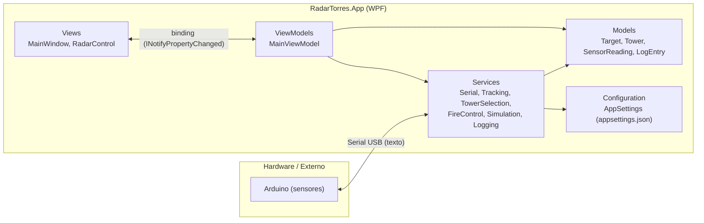

# Arquitetura do Sistema

## 1. Visão geral em camadas



* **Views** são "burras": apenas XAML + pequenos encaminhamentos de eventos de UI (ex.:
  clique em um alvo do radar chama `MainViewModel.SelectTargetById`).
* **ViewModels** (`MainViewModel`) orquestram os serviços — decidem *quando* chamar cada
  serviço em resposta a eventos, mas não implementam nenhuma regra de negócio.
* **Services** concentram toda a lógica: protocolo serial, rastreamento de alvos, seleção de
  torres, controle de acionamento e simulação. São interfaces (`I*Service`) + implementação,
  o que permite trocar qualquer um deles (ex.: por um dublê de teste) sem tocar na UI.
* **Models** são entidades de domínio simples, com `INotifyPropertyChanged` para permitir que
  a UI reaja a mudanças de estado sem que a ViewModel precise "empurrar" cada atualização
  manualmente.
* **Configuration** isola tudo que deve ser facilmente ajustável (portas, baud rate, torres,
  distâncias, timeouts) em `appsettings.json`, carregado uma única vez na inicialização.

## 2. Por que não um MVVM framework externo (Prism, CommunityToolkit.Mvvm, etc.)?

O projeto é de porte pequeno/médio e para fins didáticos (TCC). Implementar manualmente
`INotifyPropertyChanged` (`ViewModelBase`) e `ICommand` (`RelayCommand`) — cerca de 60 linhas
no total — evita uma dependência externa e deixa **todo** o mecanismo de binding visível e
explicável linha a linha na defesa do trabalho. Se o projeto crescer, a migração para
`CommunityToolkit.Mvvm` é direta, pois os nomes/padrões já seguem a mesma convenção.

## 3. Fluxo de dados de uma leitura, do sensor até a tela

```mermaid
sequenceDiagram
    participant Arduino
    participant SerialSvc as SerialCommunicationService
    participant Parser as SerialProtocolParser
    participant VM as MainViewModel
    participant Track as TargetTrackingService
    participant Tower as TowerSelectionService
    participant Fire as FireControlService
    participant Radar as RadarControl (UI)

    Arduino->>SerialSvc: "TARGET;ID=1;ANGLE=45;DIST=2.80\n"
    SerialSvc->>Parser: TryParse(linha)
    Parser-->>SerialSvc: TargetMessage(1, 45, 2.80)
    SerialSvc->>VM: evento MessageReceived
    VM->>Track: ProcessReading(SensorReading)
    Track->>Track: cria/atualiza Target (X,Y,Quadrante)
    Track-->>VM: evento TargetCreated/TargetUpdated (thread de UI)
    VM->>Tower: SelectTowerFor(target)  [se modo ≥ Localização+Torre]
    Tower-->>VM: TowerSelectionResult
    VM->>Fire: TryFireAsync(...)  [se modo = Localização+Auto e autorizado]
    Track-->>Radar: binding automático (ObservableCollection<Target>)
    Radar->>Radar: timer de renderização reposiciona os elementos gráficos
```

## 4. Concorrência — resumo das decisões

| Fonte de trabalho em segundo plano | Mecanismo | Como retorna à UI com segurança |
|---|---|---|
| Leitura contínua da porta serial | `Task.Run` dedicado (`SerialCommunicationService.ReadLoop`) com `SerialPort.ReadLine()` + `ReadTimeout` curto para permitir cancelamento cooperativo | Serviços consumidores (`LoggingService`, `TargetTrackingService`) despacham para o `Dispatcher` da UI internamente |
| Abertura/fechamento de porta | `Task.Run` dentro de métodos `async` (`ConnectAsync`) | `await`, nunca bloqueia a thread de UI que chamou |
| Watchdog de conexão | `System.Threading.Timer` (thread pool) | Só altera estado observável (`ConnectionState`); consumidores despacham |
| Geração de alvos simulados | `System.Threading.Timer` (thread pool) + `Random.Shared` (thread-safe) | Mesmo caminho de `ProcessReading` que as leituras reais |
| Timeout/expiração de alvos | `System.Threading.Timer` interno ao `TargetTrackingService` | Mutações de `ObservableCollection<Target>` despachadas via `Dispatcher.Invoke` |
| Redesenho do radar | `DispatcherTimer` (já roda na thread de UI, por design da própria classe) | N/A — já está na UI thread |
| Reset visual pós-acionamento | `Task.Delay` em `FireControlService` | Despachado via `Dispatcher.Invoke` antes de tocar `Tower.State` |

**Regra geral adotada no projeto:** qualquer classe que exponha coleções vinculadas à UI
(`ObservableCollection<T>`) ou dispare eventos que a ViewModel usa para atualizar
propriedades vinculadas é responsável por garantir, ela mesma, que a mutação ocorra na
thread de UI (captura o `Dispatcher` no construtor e usa `CheckAccess()`/`Invoke`/`BeginInvoke`).
Isso evita que o `MainViewModel` — ou qualquer código futuro — precise lembrar de fazer esse
despacho manualmente em todo lugar.

## 5. Extensibilidade

* **Trocar o protocolo serial:** só `SerialProtocolParser` precisa mudar; todo o resto do
  sistema consome os tipos `SerialMessage` já decodificados.
* **Adicionar/remover torres:** apenas editar `appsettings.json` (`Towers`), sem recompilar.
* **Novo tipo de sensor/fonte de dados:** basta produzir objetos `SensorReading` e chamar
  `ITargetTrackingService.ProcessReading` — é exatamente assim que tanto a serial real quanto
  o simulador alimentam o mesmo pipeline.
* **Novo algoritmo de seleção de torre:** `ITowerSelectionService` pode ganhar uma implementação
  alternativa (ex.: considerando ângulo de cobertura, carga de trabalho por torre, etc.) sem
  tocar em nenhuma outra camada.
